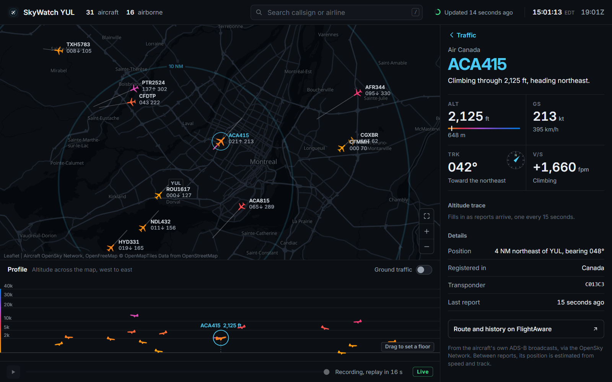
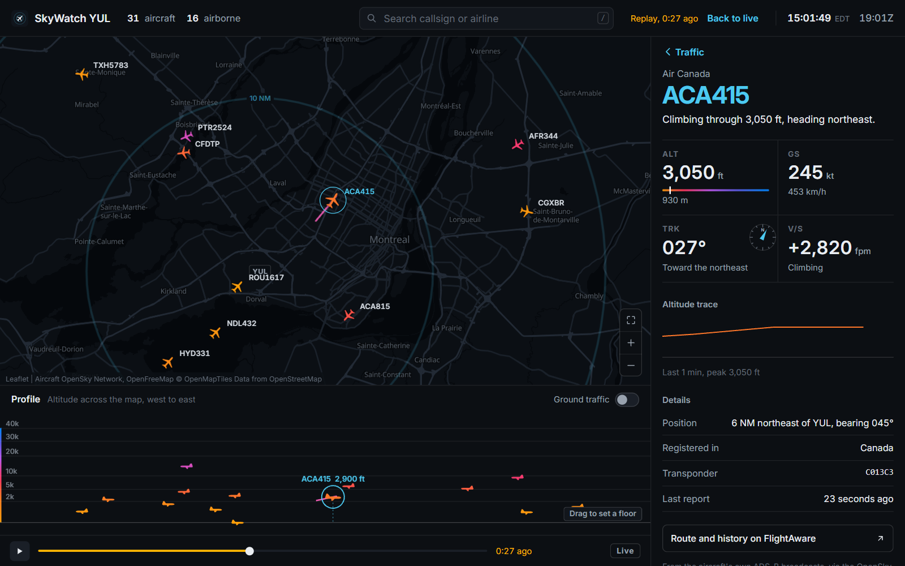
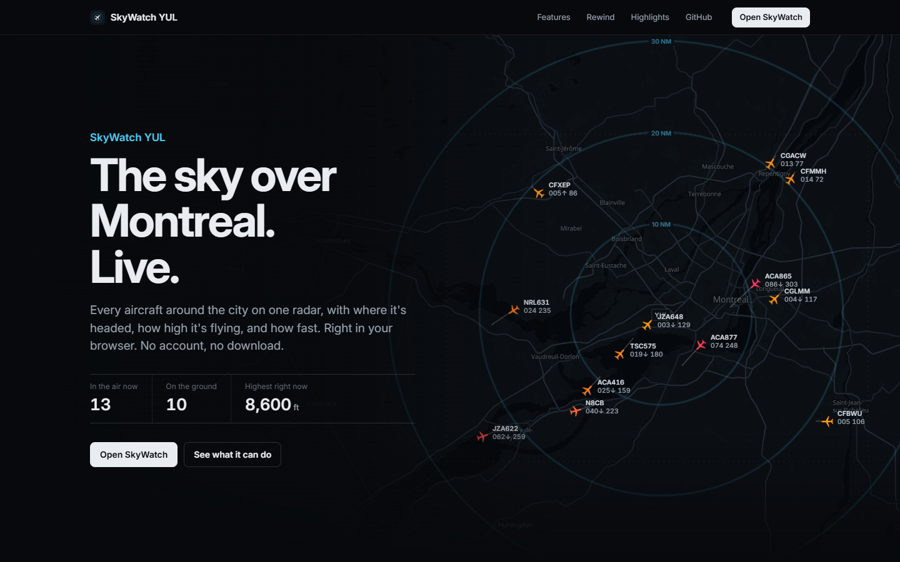

# SkyWatch YUL

A live tracker for every aircraft over Montreal, built on real-time ADS-B
transponder data from the [OpenSky Network](https://opensky-network.org/).



## What it does

- **A live radar-style map.** Every plane in range, facing the way it's
  flying and colored by altitude, with a data block beside it the way air
  traffic control shows targets: callsign, altitude in hundreds of feet, and
  ground speed. A line ahead of each plane shows where it will be in one
  minute, and range rings mark 10, 20, and 30 nautical miles from YUL.
- **Planes that keep moving.** New data arrives every 15 seconds; in between,
  every plane is carried forward along its reported track (dead reckoning),
  so the map never freezes.
- **A vertical profile.** Under the map runs a side view of the airspace,
  like the vertical situation display in a modern cockpit: altitude against
  east and west, with every plane lined up exactly under its spot on the map,
  even as you pan and zoom. Drag the amber line to hide everything below an
  altitude.
- **Flight strips and a readout.** The traffic list is laid out like a
  controller's flight strips. Pick a plane for its altitude, ground speed,
  track, vertical speed, an altitude trace, and where it is relative to YUL.
- **Replay.** Scrub back through the last ten minutes, or press play to watch
  them again at ten times speed.
- **Search** by callsign, airline, or transponder code, with full keyboard
  support (`/` to search, arrow keys to pick, Escape to back out).



The front page introduces it like a product, with the live radar running
behind the headline and every feature shown working with real traffic.



## Stack

- **Backend:** FastAPI (Python). `/api/flights` serves OpenSky's data through
  a shared cache, and `/api/health` reports how that cache is doing.
- **Frontend:** React and Vite. Leaflet runs the map, MapLibre GL draws the
  vector basemap, and the vertical profile is drawn on a canvas.
- **Data:** the OpenSky Network REST API (anonymous access). Basemaps come
  from OpenFreeMap, which needs no API key.

## The interesting problem: a 400-call budget

Anonymous OpenSky access allows roughly 400 API calls per day, and the data
only updates every 10 seconds anyway. Calling OpenSky once per browser
request would burn the budget in minutes with a handful of users.

The backend solves this with a lazy cache. Each request checks when OpenSky
was last asked, and only asks again if that was more than 15 seconds ago. Any
number of simultaneous users costs at most one upstream call per 15-second
window, and zero calls when nobody is looking. If OpenSky is unreachable, the
backend serves the stale snapshot instead of an error, since a slightly old
plane position beats a broken map.

Three details make that hold up:

- **A lock around the cache.** FastAPI runs plain `def` routes on a thread
  pool, so requests really can arrive at the same instant. Without the lock,
  20 requests landing just after the cache expired would all see it as stale
  and all call OpenSky. `backend/test_main.py` checks this by firing 20
  simultaneous requests at a slow, fake OpenSky and expecting exactly one call.
  The first version of this project, which had no lock, makes 20.
- **Failures start a new window too.** If OpenSky errors, the server waits out
  the 15 seconds before trying again instead of retrying on every request.
- **Hidden tabs stop asking.** One forgotten background tab polling every 15
  seconds would use up the whole day's budget in under two hours. The map
  pauses while its tab is hidden and catches up the moment you come back.

Even with all that, 400 calls at one per 15 seconds is about 100 minutes of
live tracking a day. Registered OpenSky accounts get 4,000 calls, which is the
obvious next step.

## Moving between updates

A new snapshot only arrives every 15 seconds. Drawn as-is, every plane would
sit still and then jump. Instead, the frontend does what radar screens do
between sweeps: it assumes each plane keeps its reported ground speed and
track, and moves it along that line (`frontend/src/lib/motion.js`). When the
next snapshot lands, each plane glides from the guessed position to the real
one over about a second. The map and the profile read from the same motion
model, so they always agree.

Two details keep the guesses honest. Each position is projected forward from
the time the plane actually reported it, not from when the snapshot was
taken. And the browser lines its clock up with the server's (using the HTTP
`Date` header), so a laptop with the wrong time still moves planes the right
distance.

Replay works the other way around: the page keeps every plane's reports from
the last ten minutes, and to show an earlier moment it blends between the two
reports on either side of it (`frontend/src/lib/replay.js`).

## Running locally

Backend (from the repo root):

```
pip install -r backend/requirements.txt
python -m uvicorn backend.main:app --port 8000
```

Frontend (in a second terminal):

```
cd frontend
npm install
npm run dev
```

Open http://localhost:5173. The Vite dev server forwards `/api` to the backend.

Tests (from the repo root):

```
python -m unittest backend.test_main -v
```

The tests replace OpenSky with a fake, so they run offline and don't touch
the daily budget.

## Project layout

```
backend/
  main.py            the API: OpenSky proxy, cache, and health route
  test_main.py       tests for parsing and the caching rules
frontend/src/
  pages/             Landing.jsx (front page) and MapPage.jsx (the tracker)
  components/        the map, profile, flight strips, readout, replay bar,
                     and the front page's rewind animation
  hooks/             polling (useFlights), the clock, scroll reveals
  lib/               units and names (flights.js), dead reckoning (motion.js),
                     replay (replay.js), map style
fetch_flights.py     the first milestone: prints the planes overhead
```

## Possible next steps

- Register OpenSky OAuth2 credentials (4,000 calls a day instead of 400)
- Deploy it. The frontend reads `VITE_API_URL`, so the API can live elsewhere.
- Let users pan to any region instead of the fixed Montreal box

Aircraft data from the OpenSky Network. Map data © OpenStreetMap contributors,
tiles by OpenFreeMap and OpenMapTiles. For watching, not for navigation.
